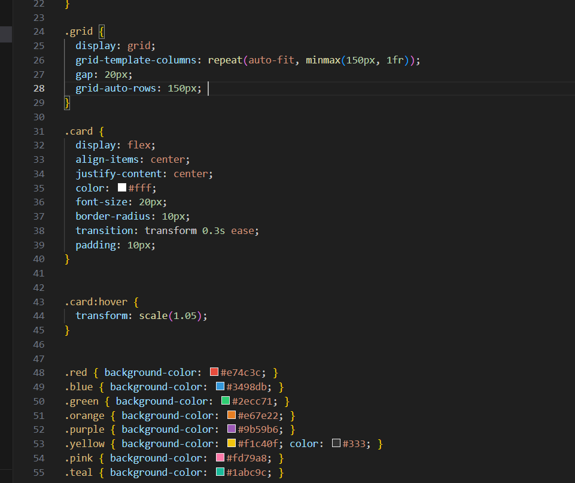

# grid
I learned how to:
- Use **CSS Grid** to create dynamic, responsive layouts
- Apply **different card sizes** using `grid-column` and `grid-row` spans.

It helped me understand how layouts adjust across screen sizes and how to manage space in a flexible way.
....
I enjoyed building the **uneven-sized color cards** the most. Creating cards that could be **tall, wide, or big** and arranging them in a flexible layout was both fun and challenging.
If I had more time, I would:
- Add **drag-and-drop functionality** to rearrange cards

 
[watch demo](demo.mp4)